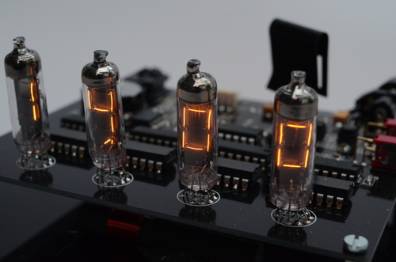
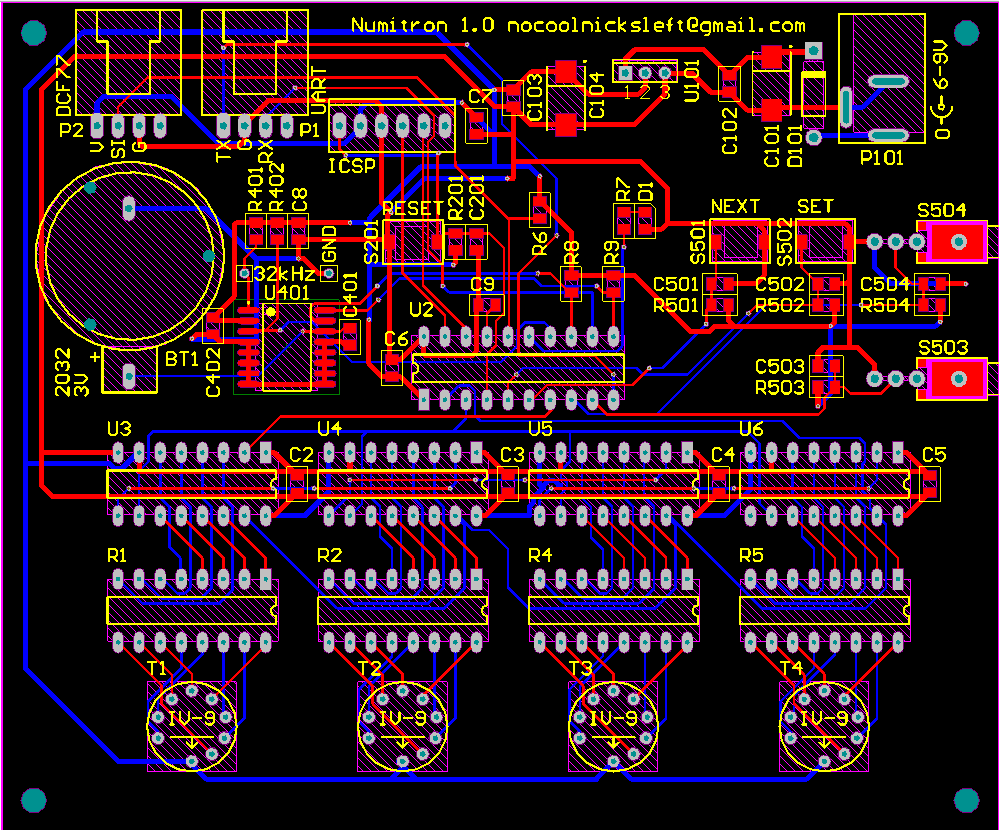

###NumitronClock

Clock made with 7-segment incandescent display tubes. They give a very warm light.

The clock is deliberateley not driven in a multiplex way. Reasons for this are the I wanted to take interesting photographs of it and of course that it will be better for the tubes lifetime. And having thouse symmetric looking DIL-Components behind each digit looks nice as well.

More features are a high precision DC3231 RTC with integrated crystal, connection for UART interface and time-signal receiver.

###Tools

PIC18F14K50 MCU

Microchip MPLAB X

C18 C-Compiler

And the boards where made with Altium Designer, a first for me but I think it turned out very nicely. 

###License

[BSD](LICENSE-BSD.txt) for software

[Creative Commons 4.0](LICENSE-CC.txt) for pcb and other artwork

###Copyright

Copyright (c) 2016 Bjoern Seip

